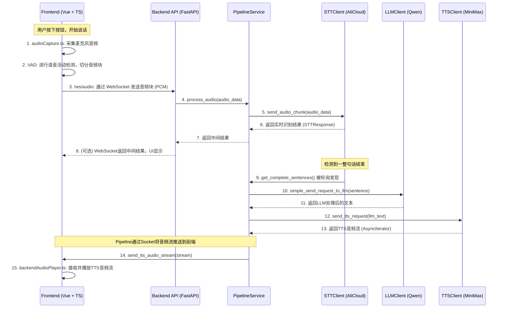

# Lumina 代码导览：从前端到后端的完整链路解析

## 简介

本文档旨在提供一份详尽的、从高层到低层的代码导览，帮助开发人员在阅读源码前，能系统地了解 Lumina 项目中前端与后端的交互方式，特别是实时音频处理的核心链路。

我们的目标是：
- **建立全局观**：清晰地展示从用户发出声音到系统响应的全过程。
- **降低理解成本**：通过由抽象到具体、逐层深入的方式，平滑学习曲线。
- **提升掌控力**：阐明关键模块的职责和交互，为调试和重构提供清晰的指引。

## 1. 宏观视角：端到端数据流

在深入代码细节之前，我们先从最高层视角看一下整个系统的核心数据流。用户的语音输入如何被处理，并最终触发系统的语音响应。

**核心流程解读**:
1.  **前端音频采集**：一切始于前端。`frontend/src/services/audioCapture.ts` 负责从麦克风获取音频流。通过语音活动检测（VAD），它将连续的语音切成一个个小的数据块。
2.  **WebSocket通信**：这些音频数据块通过 WebSocket 发送到后端的 `/ws/audio` 接口。这是一个持续的、实时的过程。
3.  **后端入口与编排**：后端的 `audio.py` 文件定义了 `/ws/audio` 这个入口点。它接收到音频数据后，立即将其交给核心的 `PipelineService`。
4.  **STT处理**：`PipelineService` 将音频块转发给 `STTClient` 的具体实现（`AliCloudSTTAdapter`），后者与阿里云服务通信，获取实时识别结果。
5.  **服务闭环**：`PipelineService` 中有一个独立的监控任务 (`_monitor_stt_buffer`)，它会定期检查 `STTClient` 是否已经识别出完整的句子。一旦发现，它就将句子文本送入 LLM，再将 LLM 的响应文本送入 TTS 服务，最后将生成的音频流送回前端播放。

---

## 2. 网关层：API Endpoints (`audio.py`, `control.py`)

这是前端与后端交互的直接门户，负责处理所有传入的 WebSocket 和 HTTP 请求。

### 2.1. 音频入口: `audio.py`

这个文件定义了两个核心的 WebSocket 端点。

-   **`@router.websocket("/ws/audio")`**:
    -   **职责**: 这是系统最核心的接口，用于接收从前端发送过来的实时音频流。
    -   **前端对接**: `frontend/src/services/audioCapture.ts`。该文件中的逻辑会在用户说话时，建立到此端点的 WebSocket 连接，并持续发送 VAD 切割后的 PCM 音频数据。
    -   **后端处理**:
        1.  **接受连接**: `await websocket.accept()`。
        2.  **启动会话**: 调用 `pipeline_service.start_stt_session()`，准备开始语音识别。
        3.  **循环接收**: `async for data in websocket.iter_bytes()`，持续地从 WebSocket 中读取音频数据。
        4.  **调用核心服务**: 将每个音频数据块封装成 `AudioData` 对象，并调用 `pipeline_service.process_audio(audio_data)`。
        5.  **发送结果**: `pipeline_service` 返回的识别结果（`STTResponse`）被格式化为 JSON，通过 `websocket.send_json()` 发送回前端，用于UI实时显示。
    -   **调试技巧**: 如果要调试音频输入问题，这里是第一个断点。可以检查 `data` 的大小和内容，确认前端数据是否正确发送。

-   **`@router.websocket("/ws/silence")`**:
    -   **职责**: 接收前端发送的关于用户静音时长的事件。这可以用于更精细的对话轮次控制（Turn-taking）。
    -   **前端对接**: `frontend/src/services/audioCapture.ts` 或 `eventListener.ts` 可能会在 VAD 检测到静音时，向此端点发送消息，如 `{"silence_ms": 1000}`。

### 2.2. 控制入口: `control.py`

这个文件负责处理"带外（out-of-band）"的控制信令，不涉及主要的音视频数据流。

-   **`@router.websocket("/ws/control")`**:
    -   **职责**: 建立一个持久的控制信道，用于后端向前端发送指令，或前端向后端查询状态。
    -   **前端对接**: `frontend/src/services/eventListener.ts` 或根组件 `App.vue` 可能会在启动时建立此连接。
    -   **后端处理**: `ControlConnectionManager` 类管理所有连接的前端客户端。后端可以通过调用 `control_manager.broadcast_control_message()` 向所有或特定的前端发送控制消息，例如让前端UI重置状态。

-   **HTTP 控制接口 (e.g., `@router.post("/reset-to-initial")`)**:
    -   **职责**: 提供简单的 HTTP 端点，方便从其他后端服务或调试工具触发对前端的状态控制。

---

## 3. 总指挥：`PipelineService` (`pipeline.py`)

如果说 API 是网关，那么 `PipelineService` 就是整个后端处理流程的总指挥。它以服务化的方式将 STT、LLM、TTS 等模块串联起来。

-   **数据结构**:
    -   `stt_client: STTClient`: 持有 STT 服务的实例。
    -   `tts_client: TTSClient`: 持有 TTS 服务的实例。
    -   `tts_monitor_task`: 一个 `asyncio.Task`，负责执行 `_monitor_stt_buffer` 协程。

-   **核心算法/逻辑**:
    -   **`process_audio(audio_data)`**:
        -   **功能**: 这是被 API 层调用的核心方法。它接收单个音频块。
        -   **逻辑**: 非常简单直接，它只是将 `audio_data` 传递给 `self.stt_client.send_audio_chunk(audio_data)`。它扮演了一个"代理"或"转发者"的角色。
        -   **返回值**: 将 `stt_client` 的返回值 `STTResponse` 直接返回给 API 层。

    -   **`_monitor_stt_buffer()`**:
        -   **功能**: 这是实现"响应"的关键。它是一个后台循环任务，模拟了响应式行为。
        -   **逻辑**:
            1.  在一个 `while self.running:` 循环中，以固定的时间间隔（`self.check_interval`）执行。
            2.  调用 `await self.stt_client.get_complete_sentences()` 检查 STT 引擎是否已经处理完一句完整的话。
            3.  如果列表不为空，它就取走这些句子。
            4.  **重要**: 调用 `await self.stt_client.clear_sentence_buffer()` 清空缓冲区，避免重复处理。
            5.  将句子文本传入 LLM (`simple_send_request_to_llm`)。
            6.  将 LLM 的结果传入 TTS (`self.tts_client.send_tts_request`)，获取音频流。
            7.  调用 `send_tts_audio_stream(audio_stream)` 将音频流发送回前端。
        -   **调试技巧**: 如果系统能识别但"不说话"，那么应该在此函数中设置断点。检查 `sentences` 是否有内容，LLM 和 TTS 的调用是否成功。

---

## 4. 蓝图：通信协议 (`stt.py`, `tts.py`)

在面向对象设计中，首先定义接口（或协议）是一种非常好的实践。它将"做什么"和"怎么做"分离开来。这个项目就大量使用了 `typing.Protocol` 来实现这一点。

### 4.1. `stt.py`

-   **`STTClient(Protocol)`**:
    -   **职责**: 定义了一个合格的"语音识别服务"必须具备哪些能力。任何实现了这些方法的类，都可以被 `PipelineService` 使用。
    -   **关键方法**:
        -   `start_session()`: 开始一次新的识别。
        -   `send_audio_chunk(audio_data)`: 发送一小块音频并获取当前结果。
        -   `end_session()`: 结束识别，获取最终结果。
        -   `get_complete_sentences()`: **（核心）** 获取内部缓冲区里所有已识别的、完整的句子。这是 `PipelineService` 决定何时触发 LLM 和 TTS 的依据。
        -   `clear_sentence_buffer()`: 清空内部缓冲区。

-   **数据结构**:
    -   `@dataclass AudioData`: 封装了 `bytes` 类型的音频数据。
    -   `@dataclass STTResponse`: 封装了识别结果，包含 `text: str` 和 `is_final: bool`。

### 4.2. `tts.py`

-   **`TTSClient(Protocol)`**:
    -   **职责**: 定义了一个合格的"文本转语音服务"需要具备的能力。
    -   **关键方法**: `send_tts_request(text)`。注意其返回值 `AsyncIterator[TTSResponse]`，这意味着 TTS 的实现必须是流式的，能够异步地、一块一块地产生音频数据。

-   **数据结构**:
    -   `@dataclass TTSResponse`: 封装了一小块 PCM 音频数据 `audio_chunk: bytes`。

---

## 5. 工人：具体实现

这里是协议的具体实现，即"如何做事"的部分。

### 5.1. STT 实现: `alicloud_client.py`

-   **`AliCloudSTTAdapter(STTClient)`**:
    -   **职责**: 实现了 `STTClient` 协议，专门用于对接阿里云的实时语音识别服务。
    -   **内部逻辑**:
        -   **封装 `nls` SDK**: 核心是调用 `nls.NlsSpeechTranscriber` 这个第三方库。
        -   **异步处理**: `nls` SDK 是基于回调的，并且其启动/停止是阻塞的。为了在 FastAPI (asyncio) 中使用，这个适配器巧妙地使用了 `threading` 和 `asyncio.Future`。`start_session` 会在一个新线程中调用阻塞的 `transcriber.start()`，然后主协程 `await` 一个 `future` 对象，直到回调函数 `_on_start` 在另一个线程中被触发，并通过 `loop.call_soon_threadsafe` 来 `set_result`。
        -   **回调驱动**: 真正的识别结果是在回调函数中处理的：
            -   `_on_sentence_end`: 当阿里云服务认为一句话结束时，这个函数会被调用。**它会将完整的句子存入 `self.complete_sentences` 列表中**。这就是 `get_complete_sentences()` 方法的数据来源。
        -   **状态管理**: 管理 `transcriber` 实例的生命周期，以及重连逻辑 (`_reconnect`)。

### 5.2. TTS 实现: `tts.py`

-   **`MiniMaxTTSClient(TTSClient)`**:
    -   **职责**: 实现了 `TTSClient` 协议，用于对接 MiniMax 的 T2A V2 接口。
    -   **内部逻辑**:
        -   **WebSocket 通信**: 使用 `websockets` 库连接到 MiniMax 的服务器。
        -   **流式返回**: 在 `send_tts_request` 方法中，使用了 `yield` 关键字，使其成为一个异步生成器。它会循环接收 WebSocket 消息，每收到一段 `data.audio`，就 `yield TTSResponse(audio_chunk=pcm_bytes)`。这使得上层调用者可以流式地处理音频，而不是等待整个音频文件生成完毕。

---

## 6. 备用入口：Socket 适配器

除了从前端 WebSocket 接收音频，系统还设计了通过 Socket 从其他进程（如一个独立的 Rust 程序）接收音频的能力。这对于系统集成和测试非常有帮助。

### 6.1. 通用工具: `services/socket.py`

-   **`UnifiedSocket`**:
    -   **职责**: 这是一个非常实用的工具类，它封装了在不同操作系统上创建套接字服务器的差异。在 Windows 上，它使用 TCP 套接字；在 Unix/Linux/macOS 上，它使用 Unix 域套接字。
    -   **功能**: 提供统一的 `start()`, `stop()`, `send_data()` 接口。

### 6.2. 适配器: `stt/socket_adapter.py`, `stt/unix_socket_adapter.py`

-   **`SocketSTTHandler`, `UnixSocketSTTHandler`**:
    -   **职责**: 这两个类的功能几乎相同，都是创建一个套接字服务器来监听音频数据。
    -   **数据协议**: 它们与客户端约定了一种简单的二进制协议：每条消息都以一个4字节的小端序整数开头，表示后续数据的长度。
    -   **处理流程**:
        1.  启动后，它们会创建一个（或两个）套接字服务器。
        2.  当有客户端连接并发送数据时，它们会读取长度前缀，然后读取相应长度的音频数据。
        3.  将读取到的 `bytes` 封装成 `AudioData` 对象。
        4.  调用 `self.stt_client.send_audio_chunk(audio_data)`，将数据送入 STT 引擎。
    -   **关键点**: 这条路径最终也汇合到了 `STTClient`，与从 `/ws/audio` 进来的数据流殊途同归。这体现了良好的分层设计。

## 7. 总结与后续步骤

通过本次导览，我们可以看到 Lumina 后端系统具备以下优秀的设计：
1.  **协议驱动开发**: 通过 `Protocol` 定义清晰的服务边界，易于扩展和替换实现（例如，可以轻松地再写一个 `TencentSTTAdapter`）。
2.  **清晰的分层**: API 层、服务编排层、协议层、实现层各司其职。
3.  **多路输入**: 同时支持 WebSocket 和 Socket 输入，增加了灵活性。
4.  **异步与并发处理**: 熟练地运用 `asyncio`, `threading`, `Future` 等技术解决了在异步框架中调用同步/阻塞库的难题。

**下一步建议**:
-   **调试 STT 问题**: 在 `alicloud_client.py` 的 `_on_sentence_end` 和 `_on_error` 回调中添加日志或断点。
-   **调试 TTS 问题**: 在 `pipeline.py` 的 `_monitor_stt_buffer` 中检查传入 `tts_client` 的文本是否正确，并检查 `send_tts_audio_stream` 是否被成功调用。
-   **调试音频输入**:
    -   **前端路径**: 在 `audio.py` 的 `/ws/audio` 端点检查接收到的 `data`。
    -   **Socket 路径**: 在 `socket_adapter.py` 的 `_handle_audio_connection` 中检查接收到的 `audio_data`。
-   **重构**: 如果要重构，可以从 `Protocol` 定义开始，思考是否需要调整服务间的契约。例如，是否需要在 `STTResponse` 中增加更多元数据。

希望这份报告能帮助您更好地理解和掌控您的代码。 